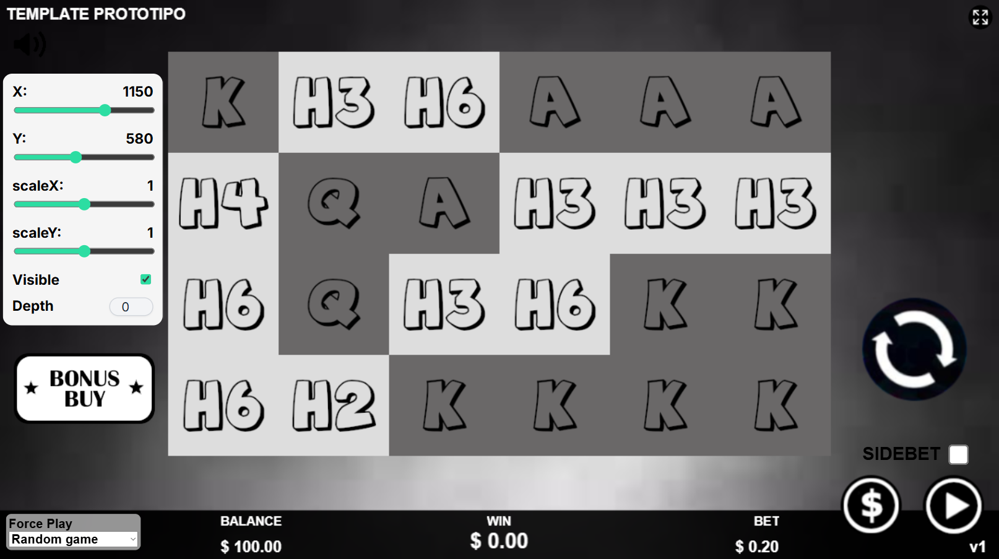

# DebugPanel

DebugPanel es una herramienta desarrollada para facilitar la edición en tiempo real de objetos dentro del juego.  

Permite ajustar propiedades de cualquier `Phaser.GameObject` mediante un panel HTML superpuesto al juego, utilizando `Phaser.GameObjects.DOMElement`.

Este panel es ideal cuando se necesite mover, escalar o modificar elementos visuales sin tocar código ni recargar la escena.

---

## Características

- Ajuste en tiempo real de:
  - posición (`x`, `y`)
  - escala (`scaleX`, `scaleY`)
  - visibilidad (`visible`)
  - profundidad (`depth`)
---

## Instalación

Cargar el HTML del panel en `Preload.js`:

```js
this.load.html('debug-panel', 'assets/utils/debug-panel.html');
```

Importar la clase:

```js
const DebugPanel = require("../../resources/utils/DebugPanel.js");
```

---

## Uso Básico

### 1. Crear un objeto que se desea depurar
```js
this.btnBonusBuy = this.add.sprite(110, 500, "ui", "btn-bonusBuy");
```

### 2. Instanciar el DebugPanel pasándole la escena y el target
```js
this.debugPanel = new DebugPanel({
    scene: this,
    target: this.btnBonusBuy
});
```

Los sliders quedarán sincronizados con los valores del objeto y se pueden editar en tiempo real.




Una vez que el elemento quede en la posición y con los parámetros deseados, es necesario copiar esos valores y aplicarlos manualmente en el código del juego.  

> [!IMPORTANT]
> El DebugPanel sirve como herramienta de ajuste visual, pero **no modifica automáticamente el código**, por lo que se deberá actualizar las propiedades del objeto en el script para mantener los cambios.

---

## API

```ts
new DebugPanel({
    scene: Phaser.Scene,          // (obligatorio)
    target: Phaser.GameObject,    // (obligatorio)
    x?: number,                   // posición X del panel
    y?: number,                   // posición Y del panel
    nameFromPreload?: string           // nombre del HTML cargado en Preload.js
    visible?: boolean           // el panel es visible o no
});
```

### Valores por defecto

| Parámetro     | Default         |
|---------------|-----------------|
| `x`           | `108`             |
| `y`           | `246`             |
| `preloadKey`  | `"debug-panel"` |
| `visible`  | `true` |

---

### Ejemplo
 
`UIViewController.js`
```js
// GameObject
this.background = this.add.image(960, 540, "bg");

// Activar panel para este objeto
this.debugPanel = new DebugPanel({
    scene: this.scene,
    target: this.background
});
```

Ahora se puede mover, escalar, ocultar o cambiar el depth del elemento `this.background` directamente desde el panel.

---
### Extender la herramienta
> [!NOTE]
> El DebugPanel puede extenderse fácilmente.  
> Si se necesita controlar propiedades adicionales del objeto como: `rotation`, `alpha`, `origin`, `tint` u otras, basta con agregarlas modificando los archivos de la herramienta:
> - Añadir un nuevo control (`input`, `slider`, `checkbox`, etc.) en `debug-panel.html`.
> - Actualizar el método `setInitialValues()` en `DebugPanel.js` para sincronizar su valor inicial.
> - Procesarlo dentro del método `update()` para aplicarlo al `target` en tiempo real.
